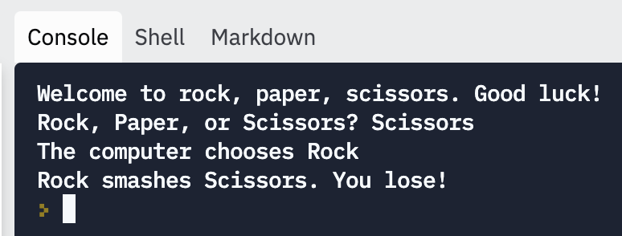
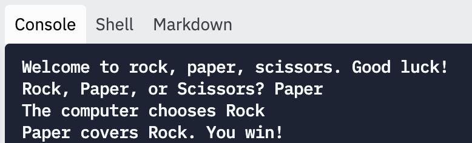
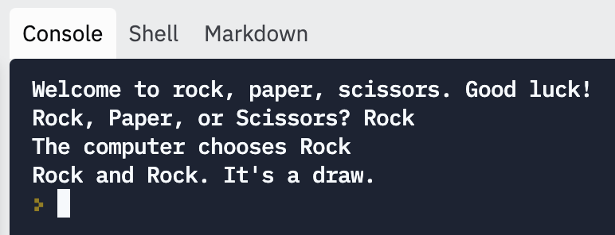
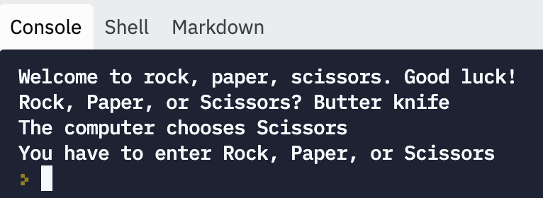

# Individual Project: Rock Paper Scissors

In this assignment, you'll recreate the classic game of rock, paper, scissors. 

If you’ve never played before, or need a refresher: two players each choose Rock, Paper, or Scissors. They show their choice at the same time. Depending on their choice, there’s a win, lose, or draw. 

- Rock smashes Scissors
- Scissors cut Paper
- Paper covers Rock
- If the two choices are the same, it’s a draw
- Rock, Paper, and Scissors are the only choices allowed.

## Your Task

### Getting started

Here are the basic steps:

- Set a value for the computer player
- Get user input for Rock, Paper, or Scissors
- Use `if` statements to print the right message, based on the computer and player choices

Try playing your Rock, Paper, Scissors game, and make sure that it works for all the different inputs. There are a lot of `if` statements to write.

**Be aware**: the user might not type in exactly “Rock” “Paper” or “Scissors”. Your code should handle that case nicely, and should not error.

**Sample Runs**

- Use `random` to randomize the computer choice. The computer player should choose randomly between Rock, Paper, and Scissors.

### Test and Submit
Once you finish coding the section above, you should:

1. Play your game, and make sure that it’s working for all the different inputs. It’s not fun if the conditionals don’t work, because it feels like the game is broken.

2. Click “Submit”

## Rubric

There aren't any test cases for this assignment. Instead, you'll have to check that it works for yourself.

- [ ]  The program prints out instructions for the user
- [ ]  The program prints out a different message, based on which choices the user and computer player made
- [ ]  The program runs without errors, even if the user types in the wrong thing

If you checked off all these boxes, your Rock, Paper, Scissors game is up to scratch!

If it doesn't meet these criteria, keep trying, and remember that you can ask for help. You should submit your work for feedback, whether or not you have checked off everything on this checklist.

## Remember...

- **Plan** before you code
- **Debug** if you aren't getting the desired output
- **Attend** office hours if you need additional support
- **G**o **C**limb **K**ibo!